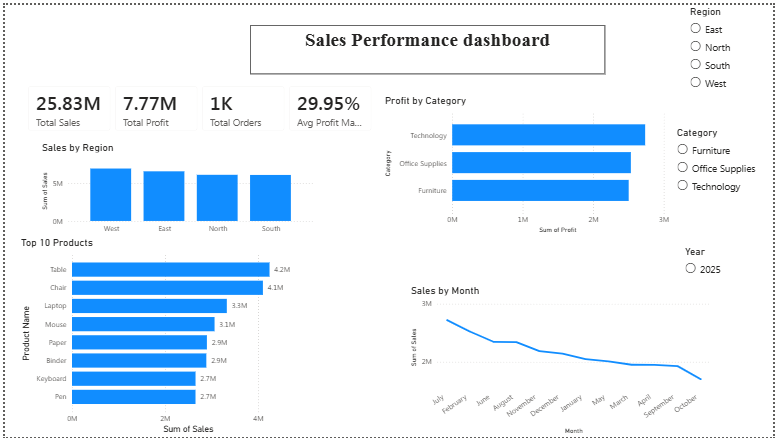

# 📊 Sales Performance Analysis Dashboard

## 📌 Project Overview
This project analyzes sales performance using SQL and Power BI. It provides insights into sales trends, regional performance, product category performance, and key business metrics through an interactive dashboard.

## 🛠️ Tools & Technologies
- SQL
- Power BI
- CSV Dataset

## 📂 Project Files
- Sales_Performance_Project_Dataset.csv
- Sales_Performance_SQL_Analysis.sql
- Sales_Performance_Dashboard.pbix

## 📈 Dashboard Features
- KPI Cards
- Monthly Sales Trend Analysis
- Region-wise Sales Performance
- Product Category Performance
- Interactive Filters & Slicers

## 💡 Key Insights
- Total Sales Performance
- Regional Sales Comparison
- Best Performing Product Categories
- Monthly Sales Trends
- Business Performance Overview

## 📷 Dashboard Preview

## 👩‍💻 Author
**Aleena Raju**
